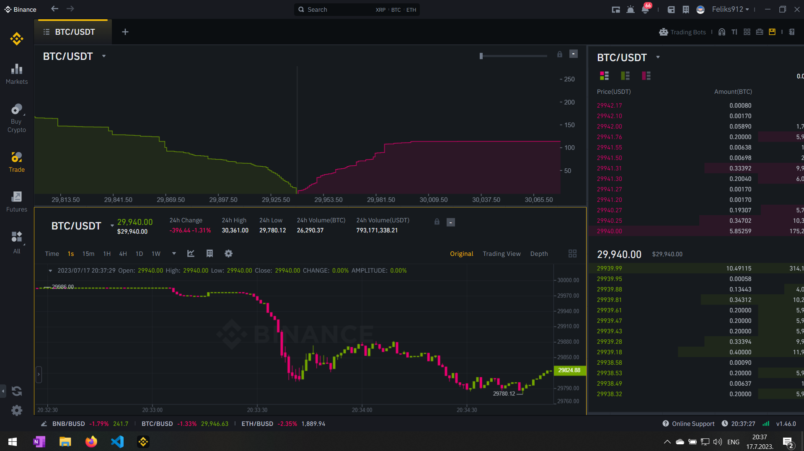

25.7.23 21:33
    Implementing responses which carry action requests or something, so we know what we asked to get such a response.
    Binance doesn't do that, but irl we use a callback. Using callbacks ensures we know what we sent, and handle the request appropriately.

20.7.23 3:43
    Instead of using transactions we must use states to run our program. States are dynamically added to a queue list and executed sequentially. One for Exchange and another for client. This replaces our latency data structures. Instead, if a request is made on t1, and it's latency is calculated to be t1', then if t1 + t1' < t2 where t2 might be the time of the next transaction, a new state of the exchange must be executed at time t1 + t1'. Same goes for the response.

    2 priority queues, one for the exchange and another local. - QueueManager.java - PriorityQueue vs TreeMap
        Each event will have it's time calculated, and inserted into the queue at the correct time
        
            This means we must introduce a new class Event, which will hold events that can happen
                

20.7.34 00:54
    Ruminating on latencies. It takes Binance the same amount of time to report on any processed request. User data stream, trade execution, transaction stream, and borrow report
    Separate latencies are for order execution and borrowings (due to time it takes Binance to get our request and process it). Other than that, we can place all 4 of the previous groups in a single report queue because they all abide by the same latency, and simply apply the latency rule (t2 + l2 >= t1 + l1).

    We will assume all new requests processed on the Binance's side happend instantaneously. On a given transaction we pack user data stream updates and action request responses in a single batch to be received on the user's end at the same time (it usually takes a few ms of difference) but *I think it's sensible*.

    The Trade execution and borrow execution will likely take a while longer to process, but we can pack the under the same latency.

    Therefore we got our latency figure out. Now to determine our states of execution.

    Our main loop is transaction-based. Meaning, every time there's a transaction we will run the loop with that transaction's timestmap. The same goes for our local loop.

        The local loop will run on a new transaction, user data stream, or action response.

            If we have to process multiple delayed events locally, we must insure they will be processed one by one, with respective delays.

                Given LR is local request, ER is exchange response, and T is a transaction, and T' is the delayed transaction received by the client

                    T1 -> T1' + LR1 -> ER1 -> LR2 -> ER2 is a normal sequence of requests and responses we can process on both the Binance and local side.

                        What happens if we use transactions to time our loops, and a new transaction comes on the exchange's side only after more than one delayed response had to be delivered to the client? That would mean that transaction on the Binance's side would likely miss some information from the client

                        The answer is to run our loops on every event that must be processed individually. I don't really know how to implement that but I'll do it.

[IMPORTANT] From Binance support 'first of all generally test-nets run under low performance, so it might take a little more time for your order/query to execute. Once you used MARGIN_BUY it won't affect your query too much. Just might be a few ms or none'

[IMPORTANT] It seems Binance doesn't execute the borrow regardless whether we're use MARGIN_BUY if enough funds is in our margin account 
    https://dev.binance.vision/t/margin-buy-does-not-execute-the-loan-if-you-have-funds/689/3
        Instead it uses the funds from our account. Fix that in code. This might change the way we handle our orders from the local side.

18.7.23 17:22
    Added action responses.
        Action responses get sent to the user immediately after processing an action request. 
        This solves the problem with order cancellation since the order remains unmoved from its current state, but the user still gets a response.
        [NOTE] orders are still rejected without the action response. Example is during borrowing before filling. The order is moved to the rejectedOrders list and sent to the user through userDataStream. it is on the user to handle that rejection properly.

    Fixed total interest calculation on the Binance's side

    Changed userDataStream to send only updated orders instead of entire lists

    Todo:
        Locally map action responses with action type (OrderAction.java) so when we receive ACTION_REJECTED we know what we're working with

        Handle local Position and Order parameter matching

        Position-specific interest calculation must be local for every case that is not automatic repay when cancelling a position

18.7.23 15:17
    Introduced Order, edited code to support it. Position now holds 2 Order which are created at the time of creating a position locally. Order requests are now sent to Binance instead of Positions
    Refactored using IntelliJ IDEA

    Todo: 
        Import to IntelliJ IDEA, handle positions in local exhchange
        FIXME: User doesn't get a response from any action unless they manually loop through positions. Add some sort of response other than updating userDataStream.
        
[IMPORTANT] Check with Binance support? How exactly are transactions behaving during the following 

17.7.23 18:02
    Moved rejection reason to Position. Now rejecting a position simply places it into rejectedPositions list and gets parsed to the client.
        FIXME: When rejecting a position it moves it into rejected positions automatically even though it might be in other position lists. This is a bug. When manually repaying a load a rejection will remove the position to the rejected positions list even though it might still be an active position? Basically make so client can't screw that one up. Separate them or something. Don't remove them. Add another list for rejected actions or only more the position to rejected positions if it didn't influence the system so far.
    
    Added checks for negative balances at all times - program exits on negative values of locked and borrowed funds, and negative total unpaid interest
    
    Edited actionRequestMap to hold multiple same actions at the same transaction timestamp. Now we can add to actionRequestMap used by LatencyManager at any time in our program and they will all be executed in that order when fetched by Binance

    Position's isStopLoss flag now influences automaticBorrow - stoplosses don't borrow

    TODO: 
        Integrate wall using latest data from our latency test - either append to data or process during runtime the choice is mine
        
        Add normally distributed latencies to latencyHandler
        
        Check and complete Binance code for non-automatic borrowings (later)
        
        Replace our linear orderbook model with a square root market impact model https://quant.stackexchange.com/questions/41937/market-impact-why-square-root
            Definitely check this too https://mfe.baruch.cuny.edu/wp-content/uploads/2017/05/Chicago2016OptimalExecution.pdf
        
        Change order IDs to use unique IDs instead of incremental numbers to simulate the fucked up nature of random IDs. (later)
        
        Implement order triggers on self-made slippage (later)
    FIXME:
        Check if walls operate the same way in all 4 dimensions of the limit stop order
            *They do not.* On rising walls sell entry orders get best buy orders at the start of the wall until the price autocorrects
                A way to avoid this is to wait for the price to consolidate, then execute a market order
                    

17.7.23 13:23
    Moved RejectionReason from UserDataResponse Map structure to Position
        I can edit Binance.java to support borrowing and repaying using Position as the amount necessary, since actions still get parsed along Position objects
    Added borrowFunds and repayFunds functions
    Added REPAY user action
    Added user data stream snapshot deep copy
    Edited borrow calculation in OrderRequest
    Todo:
        Edit borrowings in OrderRequest
            Currently using local current transaction for new market orders. Could be it changes the amount of required borrowings. Maybe it's unnecessary to use it there other than to locally check whether we can actually borrow?
            position borrowedAmount is set at the time of borrowing, calculated at the fill price.
        
        If position isStopLoss, do we borrow for it? The funds should already be in our account, and on execution it just executes and then we can repay manually? Edit OrderRequest to set auto borrows to false for stoploss orders and check the logic for non-auto borrowing orders in Binance.java
        
        Canceling an order might reject the request which will place the position in rejectedPositions and remove it from wherever it was. That is not what we want since the order we send (again, Order !== Position) is a reference to an existing position in Binance.java

        Check borrow and repay function once again, same potential issue from above. Rejected orders can only be removed from lists under certain conditions
    
    TODO: Check how walls influence the fill price might present an issue when automatically borrowing

    Todo:
        From CS Cezary:
            "If you use MARGIN_BUY, the amount necessary to borrow in order to execute your order later will be borrowed at the creation time, regardless of the order type (whether it's limit or stop-limit)."
        

16.7.23 20:56
    Todo:
        What should for new user data stream in local strategy do?
            There are multiple cases
                Failed stop-loss
                Filled limit order
                Margin level
                Repeating failed orders

16.7.23 17:49
    Added some local logic for receiving updated information from Binance

    Todo:
        Complete local binance response handling
        Manual Binance repay (basically our position exit)
        Local automatic position reversal (no repay / borrow loop - saves funds on borrow and is probably faster)
        Binance market and limit orders with manual borrow / repay
        Add Order class, change position to hold 2 orders (Order is a communication object, Position is a local storage object)
        Add reading from a csv / adding to a csv
        Implement transaction livestream
        Complete latencies and respective tests

16.7.23 15:48
    Edited a bunch of stuff, didn't keep log - mainly how Binance handles stuff
    Fixed limit position handling
        They now support 4 configurations - long / stop x isStop loss
            Limit positions act different depending on whether the stop price is above or below the limit price, but it also depends on whether it's a long or a short
    Fixed state snapshotting
        Before we sent a reference to data using UserDataResponse and LatencyHandler, now we use deep copies in UserDataResponse constructor
        Fixed for exchange -> user and user -> exchange
    Moved deep copy to Position class as a static method

    Todo: Implement local logic and test Binance's logic
    

14.7.23 19:15
    Removed manual BORROW and REPAY options
    Implemented automatic borrow and repay on order fill
        Calculating borrow amount at time of filling
            per https://www.binance.com/en/support/faq/how-to-use-the-one-click-borrow-repay-function-360032609851
        Repaying on new order cancel
    Edited a bunch of other stuff

    TODOS in ExchangeHandler
        + Edit wall logic
        + Rewrite LocalStrategyExecutor as an abstract class
        + Write basic strategy
        + Test.
        + Implement candle & position display
        + implement backtesting concurrency

[IMPORTANT] 13.7.23 17:24 Talked to customer support regarding locking funds when opening limit orders.
    Stop-limit orders lock funds at the time of executing a limit order, which is when the price crosses the stop line
    By using sideEffectType and autoRepayAtCancel we can ask Binance to borrow funds for us at the time of opening an order, and automatically repay if the order is canceled before being executed
        NOTE: Out stop-losses don't have to borrow funds. We already have them unlocked in our account if the market / limit order got filled.
            Conversation with 

13.7.23 13:36
    From ChatGPT, when shorting an asset - "The margin requirement doesn't change with fluctuations in the asset's price."
        When we borrow bitcoin we lock a fixed amount of funds with the exchange

13.7.23 4:27
    TODO: Attempt to filter entries by
        Number of candles with distances larger than set
        Distance from the previous group
        
        Edit CandlestickChart to display lowest lows and highest highs of the dataset on a press of a button
        Construct and store candles, then randomly select each one

        Entry strategy - market on range break OR close while in range
            Case a: close of tick < distance
                
            Case b: close of tick < distance below / above last range candle

        New rules:
            previous range break candle can't make a new range
                What does this mean?
            set minimum and maximum range length?
            set minimum and maximum range value? As opposed to what? Absolute? Volatility?

                We'll probably have all those statistics figured out.
                    A pure candle-based strategy doesn't have many iterations overall. We could in theory test tens of candle volumes at once given 4-8 iterations of 

                If we remove the maximum order size limit we could become risk percentage agnostic at low percentages.

                To determine the proper stoploss / exit strategy we can use trading results combined with formed candle datasets. That will give me an abillity to have formed entry statistics.

                Really we go step by step primarily for entries and stoplosses. The stoploss is mostly same for every order. Therefore the key is to get the entry figured out, and then we can iterate though candles to see where to exit etc.

12.7.23 14:33
    Mayor rewrite in progress, adding functional blocks to a simulated exchange engine
    It's an oversimplified model but 10x more reliable than the previous version. The goal is to say how we can expect similar results from live testing.

12.7.23 4:34
    Todo: Build a functional back testing engine.
        Market orders
        Limit orders
        Stop losses
        Slippage
        Latencies
        Price walls
        Margin borrows

12.7.23 1:32
    Looking to implement the following strategy - If the first candle who's' tick < distance closes outside the last candle who's' tick >= distance in the opposite direction of the move, open a limit order between the last candle's high / low and the top / bottom. Discard position after ~15 candles

    Observations:
        Unstable

11.7.23 18:00
    Days 2022-11-22 (632) to 2023-03-23 (753) (121 days total) terrible performance ~50% draw-down in a volatile period

11.7.23 15:48
    Revisited observed latencies on AWS Tokyo-based VPS t3.small

    Observations:
        TODO: More statistical analysis must be put in trade event latencies. It occurs to me there are 'walls' of transactions which all lag behind the stream during large moves. Each transaction after the next one lags by a tiny bit more ( a few milliseconds ) but they all seem to have a common offset with which they start. Example 100 102 103 104 105 106 etc but normal transactions are in the realm of 10-20 ms of latency.

        The current observed statistic is as follows
                    --- Trade Execution latency ---
            Median: 11 ms
            Mode: 10 ms
            Standard deviation: 19.115001613980795 ms
            Second standard deviation: 38.23000322796159 ms

                --- Trade Execution Response latency ---
            Median: 16 ms
            Mode: 16 ms
            Standard deviation: 22.450363561377916 ms
            Second standard deviation: 44.90072712275583 ms

                --- Transaction latency for dt < 5ms ---
            Median: 109 ms
            Mode: 7 ms
            Standard deviation: 203.8502417844852 ms
            Second standard deviation: 407.7004835689704 ms

        Where 
            Trade execution latency is the time it takes for the exchange to execute our order in their engine as opposed to the time of sending the request

            Trade execution response latency is the time it takes to receive a response from the exechange regarding the execution of our trade as opposed to the time of sending the request

            Transaction latency for dt < 5ms are the latencies of trade events when the trade is executed on the exchange in 5ms or less after the previous one. This servers as a filter to walls since we observed (and wish to prove) the highest latency trades are those which got executed in the close proximity during large price movements (but not necessary during large price movements).
                This statistical approach is not suitable for backtesting. Running a normal distribution would cause chaos. The wall starts with a seemingly random latency but each order from the wall we get after it's reported is not delayed compared to the one before it.

                Meaning when walls occur, it takes binance some time to process them and report on all of them. Meaning we can't act during wall execution. At the time of reporting the wall is already finished.

                FIXME: 
                    Implement walls in backtesting (currently only available for the symbol we live test it for).
                    
                    I'll have to implement a positive lookahead on the historical data to identify walls ahead of time. Because the delay is instantaneous (the exchange lags at the moment of processing all orders)

                    Effectivelly I'll havet to 'freeze' the program during walls because during live we can't act on that price movement in real time, only after it already happened. Regardless, since those moves are relatively small it shouldn't be an issue.

                    Also, potentially implement latency checks in a live program. It can't iterate over transactions if those transactions happened 2 seconds ago. It must ignore the wall and jump to the first price after it.

                    The bad new is, our order will likely be filled during those spikes which introduce spread
                        Please leave spread for later. It should not make or break the strategy completely.

                        On further inspection it can definitely break the strategy.
                        The price on rapid movements can be $11+. This means if we have a limit order on that level it will be filled at first available orderbook level (depending on when the exchange processes our order.) making us pay heavy fines.

                        The alternative is to be dumb. Follow price movement an act only when a level is reached. This allows us to decide whether we'll take the order at that price (also requires only market orders as entries).

                        FIXME:
                        These observations however tell a different story for our stoplosses. The fill price could be horendous and far from our linearized orderbook model ???
                            Here's how we can still use the model:
                                We make it static on each price stagnation that is, we refresh it during horizontal moves. If the price moves rapidly we adjust the model so the orderbook is used by the move of the market, giving us filling prices of the half-used orderbook.

                        Good news is - no more latency issues! If we wait for the market to stabilize (especially during non-volatile periods) we will always get a fair price + slippage from the model. Afaik that would make us makers on every order made. Hopefully irl it doesn't trigger unwanted concequences...

                        TODO: The trigger for a rest period is... how many transactions?
                            Tested on non volatile and volatile period
                                The volatile period has walls more often than it has consolidations
                                Non volatile period vice versa

                                The orderbook model is crucial during a volatile period

10.7.23 20:00 looking at implemented features

    price update
        transaction price deviation calculation
        stoploss active / closed before stoploss check
        (delayed) long/short TpRR calculation
        (delayed) new candle case
            fixedRR
            breakeven
            trailing stop
        stoploss check
            stoploss
            closed before stoploss
        remove closed positions
        margin test
        entry logic
        TODO: (delayed) entry logic change

    candle update
        set new candle flag
        this candle request latency (event + trade)
        interest calculation
        fetch candle
        closed fixedRR trades
        breakeven / trailing stop
        indicator calculation

10.7.23 6:21
    Todo: revert to original strategy, match TpRRs to opposite orders of similar distances. That should, in theory, let the runners run while getting some scalping action.

10.7.23 4:15
    2000000 candles work with 0% profit on rocky period and ~50% after with 7% draw-down check.

    Todo:
        Reintroduce limit orders
            Set stoploss at the retouch level.

9.7.2023 21:50
    Added trailing stop-loss at a percentage between previous candle close and entry.

    Observations:
        Some days are catastrophically profitable, but on others the losses recouperate

    Todo:
        500000 volume candles just don't seem to cut it on days ~450 to ~700. Try with 2mil.
        TODO: Priority - cut losses
            Loss prevention methods:
                Opposite reordering ?
                Higher distance values
                Higher ZigZag parameter values
                Rollback to matching ZigZag values with highest / lowest values
                Lower risk
                New detection method (but refactor first)
                    Note previous potential limit levels (but don't take them) and only open positions when price crosses that level. Hopefully those are potential reversal levels so them, and onwards would be a good place to start checking for levels

9.7.2023 20:33
    Reintroduced ranges to entry triggers

    Observations:
        Higher profits

    Todo:
        Introduce BE on a percentage move from the entry price, this way we'll avoid losses where price moves away from entry but hits the stoploss in the same candle. Especially true in volatile markets. Prioritize minimizing losses.

9.7.2023 20:00
    Added latency between order activation and setting a stop-loss

    Observation:
        We lost some on that one

    Todo: FIXME:
        Currently we place a stop-limit order entry request when when a new stoploss level is recognized, but I forgot to cancel the previous one on new candle formation. That takes 2*trade request latency because we must cancel, then create an order (binance, of course, doesn't support closing and creating a new order in the same request ofc ofc). I must implement the latency those two requests take.

        Also, it takes LONGER for us to get a response from the server because I've been analyzing how long it takes for the exchange to execute and order compared to when the request was sent, not how long it takes for us to receive that response. I've got to test that aswell, then implement it here.

9.7.2023 18:30
    Added trailing stop-loss on previous candle high / low
    Changed entry strategy - last low / high no longer have to match the lowest low / the highest recent high (but new orders can still only be made on a lower low / higher high using usedHigh / usedLow flags)
    The entry price is always ZigZag low / high, no more range.

    Observations:
        More positions - crazy profits, crazy losses.
    
    Todo:
        Increase distance and ZigZag values
        Introduce reversing a trade on stop
            Fixed profit to recouperate loss (depends on stoploss percentage)
        Convert to multi-threaded